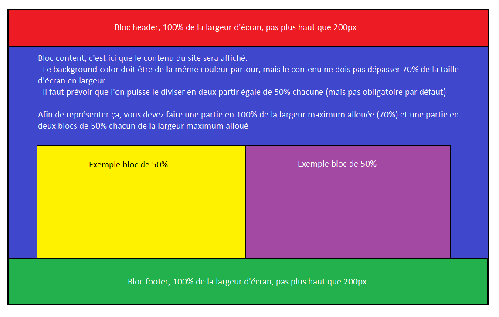

# Exercice HTML/CSS 24/09/2021 - part 2

### 1. Préparer un squelette de site web

Vous devez réaliser le squelette d'un site web, le but est que l'on puisse reprendre votre squelette afin d'avoir une base pour n'importe quel type de site web.

Voici une image des différents bloc du squelette, chaque bloc aura sa propre classe CSS.

On ne demande pas de contenu pour le moment, juste que l'on puisse facilement distinguer chaque bloc du squelette des futurs site web.

Pour cela vous utiliserez un code couleur flashy (oui, très flashy !) pour chaque bloc.

